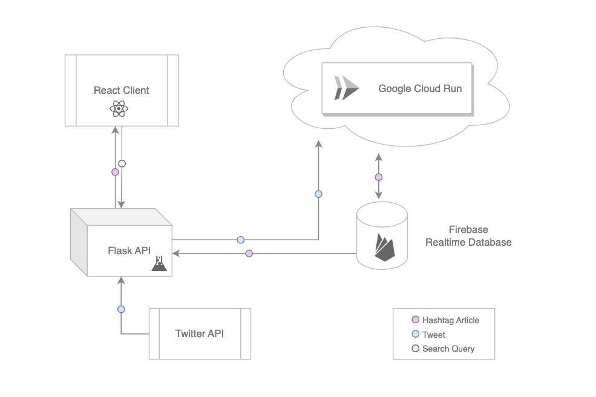

# Realtime Analysis

Realtime Analysis is a powerful platform designed to monitor and analyze tweets in real-time from a specific topic. The platform utilizes Twitter's API to transmit the tweets to a cloud function, which processes them in real-time and stores them in a database capable of maintaining instant communication with any client.

Realtime Analysis includes a user-friendly interface that allows users to visualize the evolution of any topic in real-time. Whether you're a marketer, researcher, or social media professional, Realtime Analysis provides a powerful set of tools to explore and analyze tweets and stay on top of trends in real-time.

Realtime Analysis is designed for scalability and can easily handle large volumes of tweets from diverse sources. The platform incorporates advanced data processing techniques to ensure accurate and actionable insights, such as sentiment analysis, topic modeling, and clustering.

With Realtime Analysis, you can monitor and analyze tweets in real-time, gain insights into audience sentiment, identify emerging trends, and make data-driven decisions. Whether you're monitoring a brand, tracking a crisis, or analyzing social media trends, Realtime Analysis provides a powerful platform to help you stay ahead of the curve.

### Client screens

